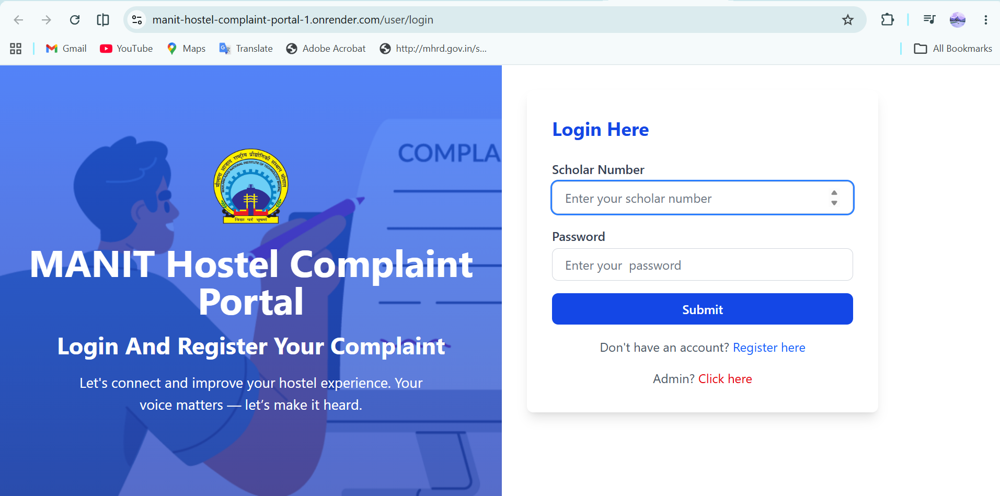
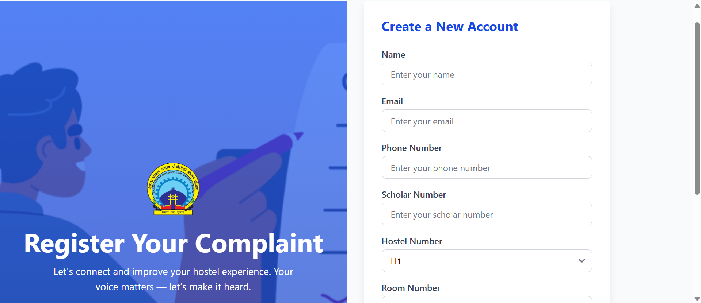
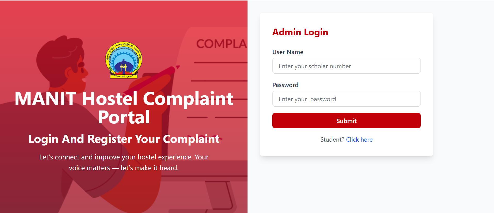
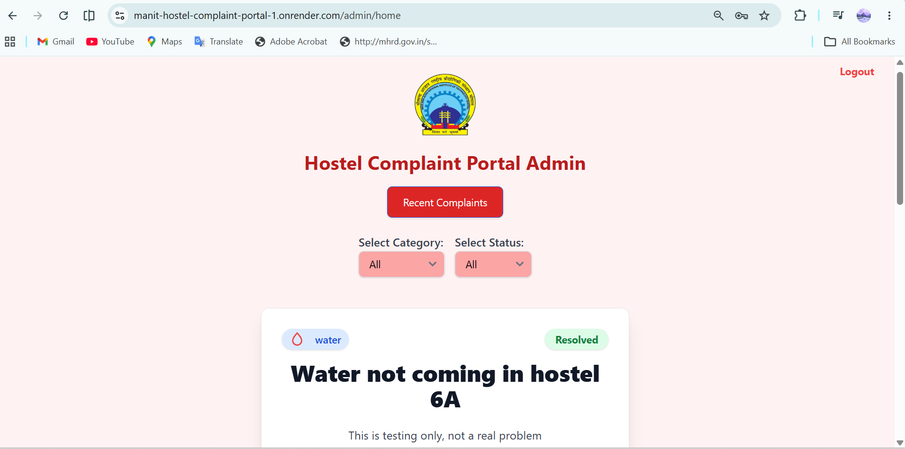
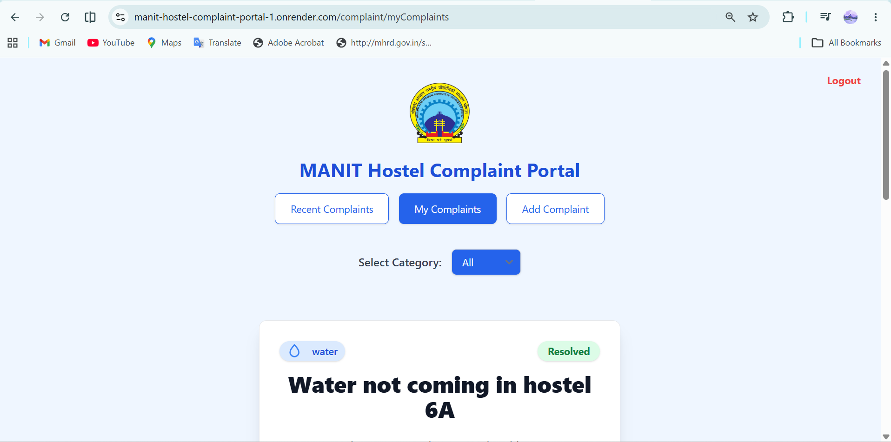
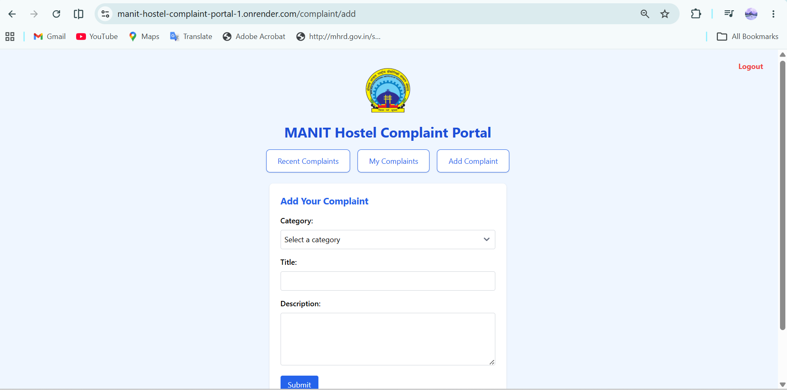

# MANIT Hostel Complaint Portal 🏢

A web-based complaint management system developed for MANIT hostels, enabling students to report issues and allowing wardens to efficiently track, manage, and resolve complaints.


---

## ✨ Features

This portal provides distinct functionalities for both students and administrators to ensure a seamless complaint resolution process.


## 📸 Screenshots

### Manit Hostel complaint portal



### Create Account



### Admin Login



### Admin Dashboard



### Student Dashboard



### Add complaint



### Upcoming Features 🚀

* 📊 Complaint Analytics Dashboard
* 📸 Image Upload with Complaints
* ⚡ Priority-Based Complaint Management
* 📧 Email Notifications
* 🔍 Advanced Complaint Search & Filtering


### For Students 🧑‍🎓

* **Secure Registration:** Easy onboarding using unique **Scholar No**, Hostel No, Room No, Email, and Phone.
* **Raise Complaints:** Quickly report problems across various predefined categories:
    * 💧 Water
    * 💡 Electricity
    * 🌐 Network / Wi-Fi
    * 🍲 Mess / Canteen
    * 🚻 Washrooms
    * 🛠️ General Maintenance
* **My Complaints Section:** A dedicated dashboard to view the status of all complaints you have submitted.
* **Mark as Resolved:** Students can close the loop by marking their own complaints as resolved once the issue is fixed.
* **Filter Complaints:** Easily filter the complaint list by category to see specific types of issues.

### For Admins (Wardens) 👨‍💼

* **Admin Login:** A secure login portal for hostel wardens and administrative staff.
* **Centralized Dashboard:** View all active and resolved complaints from all students in a single, organized interface.
* **Resolve Complaints:** Admins can update the status of a complaint to "Resolved" from their end.
* **Powerful Filtering:** Filter the entire complaint database by category (water, electricity, etc.) or status to prioritize and manage tasks effectively.

---

## 🛠️ Tech Stack

| Technology       | Usage                 |
| ---------------- | --------------------- |
| **Node.js**      | Backend Runtime       |
| **Express.js**   | Web Framework         |
| **MongoDB**      | Database              |
| **Mongoose**     | ODM for MongoDB       |
| **EJS**          | Server-Side Rendering |
| **JavaScript**   | Application Logic     |
| **HTML/CSS**     | Frontend UI           |
| **Git & GitHub** | Version Control       |

## ⚙️ Architecture

* MVC-inspired project structure
* Express.js based backend server
* MongoDB database integration using Mongoose
* JWT-based Authentication & Authorization
* Complaint management workflow for students and administrators
* Modular routing and middleware architecture


---

## 🚀 Getting Started

To get a local copy up and running, follow these simple steps.

### Prerequisites

Make sure you have the following installed on your local machine:
* [Node.js](https://nodejs.org/en/) (which includes npm)
* [MongoDB](https://www.mongodb.com/try/download/community)
* [Git](https://git-scm.com/)

### Installation

1. **Clone the repository**

   ```sh
   git clone https://github.com/ravisingh123123/MANIT-Hostel-Complaint-Portal.git
   ```

2. **Navigate to the project directory**

   ```sh
   cd MANIT-Hostel-Complaint-Portal
   ```

3. **Install NPM packages**

   ```sh
   npm install
   ```

4. **Create an environment file**

   Create a `.env` file in the root directory and add the necessary environment variables.

   ```env
MONGODB_URI=your_mongodb_connection_string
PORT=1080
JWT_SECRET=a_strong_and_long_random_secret_string
JWT_EXPIRES_IN=1d
   ```

5. **Start the server**

   ```sh
   npm start
   ```

   The application should now be running at `http://localhost:1080`.


---


---

## ⚙️ Architecture & Deployment

- MongoDB used as the primary database with **Mongoose ODM**.
- Modular route and controller structure for maintainability.

---
## 👨‍💻 Development

Adapted and extended for MANIT hostel complaint management by **Ravi Prakash**.

Key development work includes MongoDB Atlas integration, JWT authentication,
student and admin workflows, complaint management, Express 5 compatibility,
frontend rendering fixes, responsive UI improvements, and cloud deployment.

## 📄 License

This project is distributed under the GNU General Public License v3.0.
See the `LICENSE` file for complete license terms.

---
## 👨‍💻 Author

**Ravi Prakash**
B.Tech Electronics & Communication Engineering
Maulana Azad National Institute of Technology (MANIT), Bhopal

GitHub: https://github.com/ravisingh123123
